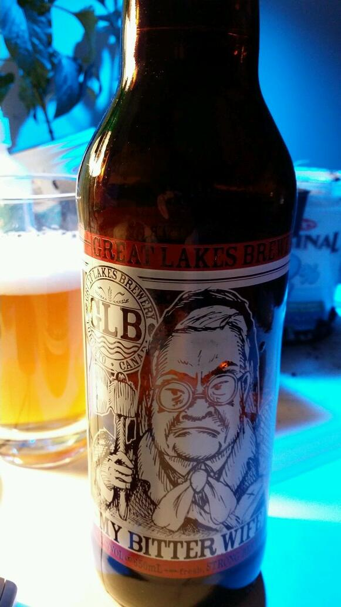

RESTful API for wfs
===

A Very Useful Document
---
https://docs.google.com/spreadsheet/ccc?key=0AjbKSMxBL3EfdEJEQlAyZXZGeFhrUmEtXzZoa0VUdkE&usp=drive_web#gid=0

Usage
---

http://wfs.openciti.ca...

...ENDPOINT.PHP?method=METHOD&.....

RTFS
---

Read the source code comments for more details

    apiadmin.php
        register
                username            unique wfs username
                password            md5 encoded password
                first               name
                last                name
                lat                 latitude
                lng                 longitude
        login
                password            md5 encoded password
                username            unique wfs username
        logout
                username            unique wfs username
                secret              wfs secret only known to developers

    apinearby.php
        nearby
                lat                 latitude
                lng                 longitude
                howmany            limit query to this many results
                restrict            true or false (if true non-business venues are not queried)
                radius              in metres

    apicheckin.php
        checkin
                id                  unique FourSquare venue id
                username            unique wfs username
        checkout
                id                  unique FourSquare venue id
                username            unique wfs username

    apisoldiers.php
        place
                id                  unique FourSquare venue id
                username            unique wfs username
                number              how many soldiers to put here
        pickup
                id                  unique FourSquare venue id
                username            unique wfs username

    apiattack.php
        attack
                id                  unique FourSquare venue id
                username            unique wfs username of the attacker
                attackers           number of soldiers to attack with
                leavebehind         number of soldiers to leave behind after victory

    apiquery.php
        user
                secret              wfs secret only known to developers
                username            unique wfs username of the attacker
        venue
                secret              wfs secret only known to developers
                id                  unique FourSquare venue id
        venuename
                secret              wfs secret only known to developers
                name                all or part of the name
        mayors
                secret              wfs secret only known to developers
        weakest
                secret              wfs secret only known to developers
                howmany             limit results to this number sorted by weakest venue

Example:
---
    http://wfs.openciti.ca/apinearby.php?method=nearby&lat=43.6666&lng=-79.4705044018&howmany=4&restrict=true&radius=2000

    {
        "response": "ok",
        "top_venues": {
            "result": [
                {
                    "venues": {
                        "id": "4adb2c64f964a520ae2421e3",
                        "name": "Crema Coffee Co.",
                        "distance": 185,
                        "checkins": 2785,
                        "lat": 43.665444738559,
                        "lng": -79.472165513691
                    }
                },
                {
                    "venues": {
                        "id": "4ce570db14682d439d298f61",
                        "name": "Starbucks",
                        "distance": 188,
                        "checkins": 1314,
                        "lat": 43.665335193728,
                        "lng": -79.47206663889
                    }
                },
                {
                    "venues": {
                        "id": "4f84799ae4b077f839341fe8",
                        "name": "3030 Dundas",
                        "distance": 97,
                        "checkins": 1092,
                        "lat": 43.665730613695,
                        "lng": -79.470407723556
                    }
                },
                {
                    "venues": {
                        "id": "4b9c345af964a520b35436e3",
                        "name": "Pho Huong",
                        "distance": 215,
                        "checkins": 942,
                        "lat": 43.665325991545,
                        "lng": -79.468490595292
                    }
                }
            ],
            "ok": 1
        }
    }

Official Beer of #RyeSuperCourse
===

http://www.greatlakesbeer.com/index.php/2014/03/24/shes-back-my-bitter-wife-ipa-set-to-return/

